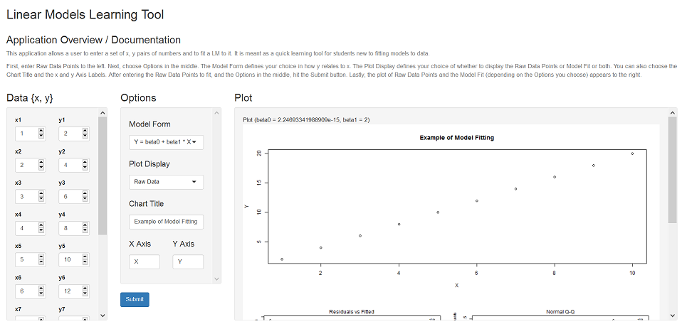
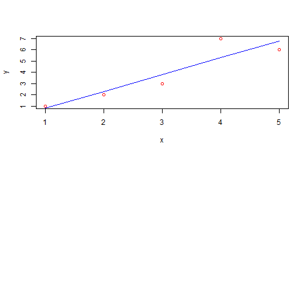

---
title       : Model Fit Learning Tool 
subtitle    : (Developing Data Products - Peer Assessment)
author      : WR 
job         : 
framework   : io2012        # {io2012, html5slides, shower, dzslides, ...}
highlighter : highlight.js  # {highlight.js, prettify, highlight}
hitheme     : tomorrow     # tomorrow  
widgets     : []            # {mathjax, quiz, bootstrap}
mode        : standalone # {standalone, draft, selfcontained}
knit        : slidify::knit2slides
--- 
## Slide 2 - Application Overview 

This application allows a user to enter a set of x, y pairs of numbers and to fit a LM to it.  It is meant as a quick learning tool for students new to fitting models to data. C


 

--- .class #id 

## Slide 3 - Pitch 

- New to Model Fitting? Or...  

- Know someone who is?  

- This application is for you!  

- Intended as an easy, intro interactive learning tool

- Uses the following Model Forms { x, sqrt(x), log10(x) } 

- Lets user choose the Raw Data Points to fit and which Model Form to use 

- After this you will be an expert (well, almost)

--- .class #id 

## Slide 4 - Use of Application / Documentation 

- First, enter Raw Data Points to the left.  

- Next, choose Options in the middle.  

- The Model Form defines your choice in how y relates to x. 

- The Plot Display defines your choice of whether to display the Raw Data Points or Model Fit or both.  

- You can also choose the Chart Title and the x and y Axis Labels. 

- After entering the Raw Data Points to fit, and the Options in the middle, hit the Submit button.

- Lastly, the plot of Raw Data Points and the Model Fit (depending on the Options you choose) appears to the right


--- .class #id 

## Slide 5 - Visual - Example of fitting data with LM:  

```r
x <- 1:5; y <- c(1:3, 7, 6); modelFit <- lm(y ~ x); 
beta0 <- modelFit$coef[1]; beta1 <- modelFit$coef[2]; y.est <- beta0 + beta1 * x
```
Resulting beta0 (``-0.7``), beta1 (``1.5``), and model (y = ``-0.7`` + ``1.5`` * x);

```r
par(mfcol = c(2,1)); plot(y ~ x, type = "p", col="red"); lines(y.est ~ x, col="blue") 
```

 
